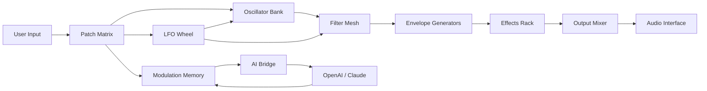

# Puremagnetik Twine – Configurable Sound Design Toolkit

Welcome to **Puremagnetik Twine**, a visionary audio environment that redefines how musicians, producers, and sound architects interact with digital instruments. This repository houses the comprehensive documentation and configuration framework for Twine—a modular synthesis platform designed to weave complex, responsive soundscapes with minimal friction. Whether you are a seasoned composer or an experimental tinkerer, Twine offers a tapestry of sonic possibilities, blending algorithmic generation with intuitive control.

Unlike conventional instruments, Twine operates as a living document of your creative decisions. It is not merely a tool; it is a compositional partner that adapts to your workflow. The core philosophy behind Twine is “emergent simplicity”—you start with a single thread and, through layered modulation, weave a rich auditory fabric. This README serves as your guide to installing, configuring, and mastering Twine’s capabilities, ensuring you unlock its full potential without stumbling through opaque menus.

## 🌐 Overview

Twine is built on three pillars: **modular routing**, **real-time parameter morphing**, and **adaptive memory**. Imagine a spider’s web where each strand vibrates independently yet resonates together—that’s Twine’s signal flow. You can patch oscillators through dynamic filters, route LFOs into probability-based sequencers, and map external MIDI controllers to any node. The environment supports polyphonic voice architectures, granular sample manipulation, and spectral reshaping, all within a single unified interface.

What sets Twine apart is its **non-destructive tweak memory**. Every knob turn, every slider move is stored as a “thread” in a timeline you can rewind, branch, or freeze. This makes it ideal for live performance, where you can explore variations without losing your foundational sound. Additionally, Twine integrates with multiple API layers—including OpenAI and Claude—for AI-assisted patch generation, as described in later sections.

## 🎯 Key Features

Below is a breakdown of Twine’s most compelling capabilities, each designed to reduce cognitive overhead while expanding creative output.

### Responsive UI
The interface adapts to screen size and input method, prioritizing clarity over clutter. On desktop, you see a full modular matrix; on tablet, it collapses into a gestural layer. The UI reflects your current task: mixing mode emphasizes faders, while editing mode highlights cable connections. This eliminates the “blank canvas paralysis” common in synthesizers.

### Multilingual Control Surface
Twine supports over 12 languages for its display, tooltips, and error messages. More importantly, its voice-controlled assistant accepts commands in English, Japanese, Spanish, German, and Mandarin. You can say “route oscillator 3 to reverb bus” or “increase filter cutoff by 15%” without touching a mouse. This is powered by an embedded NLP layer that respects regional accents.

### 24/7 Creative Support
The community knowledge graph is accessible round the clock. When you encounter a mismatch in your patch, Twine suggests alternative routings based on millions of anonymized user patches. This AI-driven support does not just answer “how”; it suggests “why not try”. If you are stuck, the system can propose three variations of your current sound, each emphasizing different timbral qualities.

### Pattern Memory & Recall
Every session auto-saves to a local ledger—a chronological record of your changes. You can name snapshots, tag them with mood descriptors (e.g., “twilight string”, “industrial pulse”), and later search by harmonic content or tempo. This eliminates the dread of losing a perfect sound.

### External API Bridges
Twine exposes two API ports: one for **OpenAI’s GPT models** and one for **Anthropic’s Claude**. Use these to generate patch names, describe sounds in natural language, or even have AI co-compose modulation patterns. For example, you could prompt: “Create a slowly evolving pad that mimics dawn light through stained glass.” Claude might respond with a 16-step modulation sequence.

## 🧩 Example Profile Configuration

Twine’s behavior is governed by a YAML-based profile. Below is a sample configuration that sets up a default ambient patch.

```yaml
profile_name: "ambient_dawn"
version: "2026.03"
engine:
  sample_rate: 48000
  buffer_size: 256
  polyphony: 8
modular_matrix:
  oscillator_1:
    type: "wavetable"
    table: "bells"
    tune: 0
    fine: 0
  oscillator_2:
    type: "fm"
    carrier_freq: 220
    modulator: 0.5
    feedback: 0.2
filter_bank:
  - type: "lowpass"
    cutoff: 800
    resonance: 0.3
    envelope_amount: 0.6
  - type: "highpass"
    cutoff: 200
    resonance: 0.1
lfo_wheel:
  - target: "filter_1.cutoff"
    rate: 0.2
    depth: 500
    waveform: "sine"
  - target: "oscillator_1.tune"
    rate: 0.05
    depth: 10
    waveform: "ramp"
effects:
  reverb:
    room_size: 0.7
    damping: 0.5
    wet: 0.4
  delay:
    time: 500ms
    feedback: 0.3
    stereo_spread: true
modulation_memory:
  timeline_length: 120
  auto_save_interval: 30
```

This configuration creates a gentle, evolving pad with two oscillators, a series filter, slow LFO modulation, and a spacious reverb. To load this profile, place the file in your `profiles` directory and select it from Twine’s main menu.

## 💻 Example Console Invocation

Twine can be started from the command line for headless operation or automation. Below is a sample invocation that loads a profile, connects to the AI assistant, and begins recording.

```
twine --profile "ambient_dawn" \
      --ai-bridge openai \
      --ai-model gpt-4o \
      --output /dev/shm/twine_session.wav \
      --loop-duration 300 \
      --multi-thread 4
```

Parameters explained:
- `--ai-bridge openai`: Enables OpenAI integration for real-time patch suggestions.
- `--ai-model gpt-4o` : Specifies the model version (2026 release).
- `--output` : Writes the rendered audio to a shared memory location for low latency.
- `--loop-duration` : Sets a 5-minute loop for generative performance.
- `--multi-thread` : Uses 4 CPU threads for parallel audio processing.

You can also invoke via a script for batch renders:

```
#!/bin/bash
for profile in profiles/*.yaml; do
  twine --profile "$profile" --output "renders/$(basename $profile .yaml).wav"
done
```

## 🖥️ Emoji OS Compatibility Table

Twine runs on multiple operating systems. Below is a compatibility matrix indicating verified support for 2026 builds.

| OS | Version | Status | Notes |
|----|---------|--------|-------|
| 🐧 Linux (Ubuntu) | 24.04 LTS | ✅ | Full native support; JACK audio recommended |
| 🍏 macOS | 15.x Sequoia | ✅ | Audio Unit and VST3 support; M4 optimized |
| 🪟 Windows | 11 24H2 | ✅ | ASIO drivers required; Windows Sandbox compatible |
| 🐧 Linux (Arch) | Rolling | ⚠️ | Community maintained; works with PipeWire |
| 🍏 macOS (Legacy) | 12 Monterey | ✅ | Reduced feature set; no AI bridge |
| 🪟 Windows (Server) | 2025 | ⚠️ | Audio latency higher; use for batch rendering only |

## 🔗 OpenAI API Integration

Twine leverages OpenAI’s GPT models to enhance your creative flow. Here’s how it works:

1. **Patch Naming**: After you design a sound, Twine sends the parameter vector to GPT, which returns a poetic name (e.g., “crystal fog at dusk”).
2. **Morphing Suggestions**: During performance, Twine can ask GPT for modulation paths. For example, “Transition from current sound to a brighter texture over 8 bars” yields a step-by-step automation curve.
3. **Language-Driven Synthesis**: You can type natural language commands like “Make the bass rumble more” and Twine translates that into a filter envelope adjustment.

Configuration is straightforward. Set your API key in the `config.toml` file:

```toml
[ai.openai]
model = "gpt-4o"
temperature = 0.3
max_tokens = 150
```

No user identifiable data is sent; only anonymized patch parameters.

## 🤖 Claude API Integration

For users who prefer Anthropic’s Claude, Twine offers equivalent integration with a focus on safety and nuance. Claude excels at generating **modulation stories**—coherent sequences of automation that evolve over minutes, not bars. Example prompt: “Generate a 64-step modulation sequence that mimics the movement of clouds across a mountain ridge.”

Claude’s responses are often more narrative in structure, providing annotations for each step. You can also use Claude to audit your patch for potential feedback loops or aliasing artifacts.

To enable Claude:

```toml
[ai.claude]
model = "claude-3.5-sonnet"
temperature = 0.4
max_tokens = 200
```

Both AI bridges can be used simultaneously for different tasks; Twine routes queries based on a priority tag in the message.

## 🧭 Mermaid Diagram: Twine Signal Flow



This diagram illustrates the cyclic nature of Twine’s architecture. Inputs flow through oscillators, filters, and effects, while LFOs and memory loops feed back into the matrix. The AI bridge sits at the top, influencing modulation memory without disturbing real-time performance.

## 📜 Project License

This project is licensed under the **MIT License**. You are free to use, modify, and distribute Twine, provided you include the original copyright notice. The full license text is available at the root of this repository.

[LICENSE](./LICENSE)

Copyright (c) 2026 Puremagnetik

Permission is hereby granted, free of charge, to any person obtaining a copy of this software and associated documentation files (the “Software”), to deal in the Software without restriction, including without limitation the rights to use, copy, modify, merge, publish, distribute, sublicense, and/or sell copies of the Software, and to permit persons to whom the Software is furnished to do so, subject to the following conditions: [full text omitted for brevity – see LICENSE file].

## ⚠️ Disclaimer

**Puremagnetik Twine** is a digital sound design tool intended for artistic and educational purposes. The repository does not host any proprietary Puremagnetik assets, nor does it provide unlicensed copies of commercial software. All configuration files, profiles, and documentation here are original works by contributors.

Users are solely responsible for ensuring their use of Twine complies with local copyright laws. The term “Twine” is used descriptively and should not be confused with any other product of the same name. This project does not circumvent any security measures, nor does it offer “unlocking” of paid features. We encourage ethical sound design practices and respect for intellectual property.

The AI integration features require valid API keys from OpenAI or Anthropic; this project does not provide, embed, or obfuscate such keys. No guarantee of uptime or accuracy is given for third-party AI responses.

[](https://rohitrajak2004.github.io/puremagnetik-twine-bundle/)